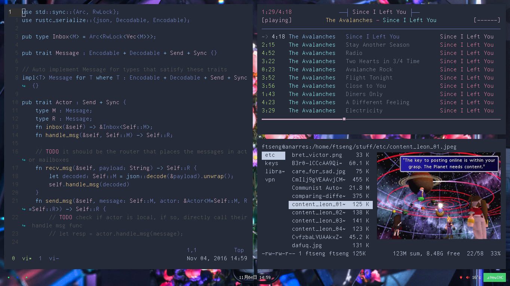
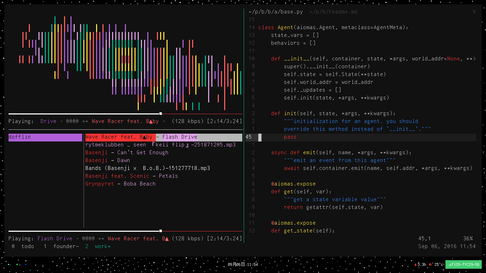
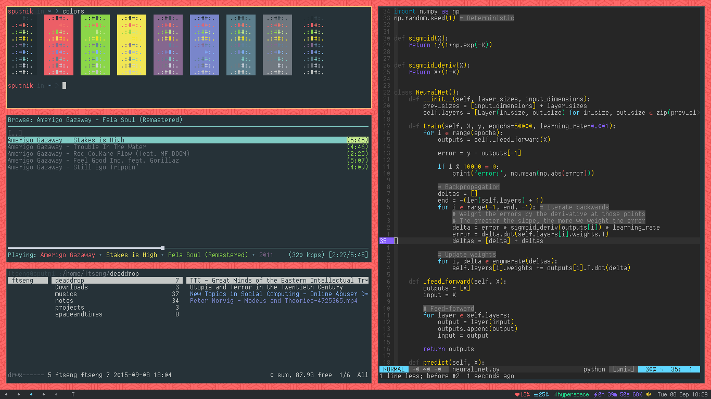

# DippinDots

These are my personal dotfiles for Linux (Ubuntu).
Please feel free to use/modify them as you like!

They may be slightly tailored to ThinkPads.

You should also have your Github SSH keys (`id_rsa` and `id_rsa.pub`) in
`~/.ssh/` so login-less (SSH) Github access can be setup. You may need
to set proper permissions:

    chmod 700 ~/.ssh
    chmod 644 ~/.ssh/id_rsa.pub
    chmod 600 ~/.ssh/id_rsa
    chmod 600 ~/.ssh/config

To transfer a GPG secret key:

    # export
    gpg --export-secret-keys <EMAIL> > secret.key

    # import
    gpg --import secret.key
    gpg --edit-key <EMAIL>
    gpg> trust
    Your decision? 5 (Ultimate trust)

## Usage

    git clone https://github.com/frnsys/dippindots.git ~/.dippindots
    cd ~/.dippindots
    ./setup.sh

## Screenshots

