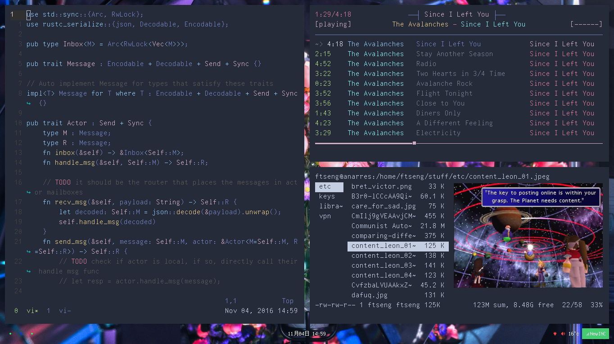
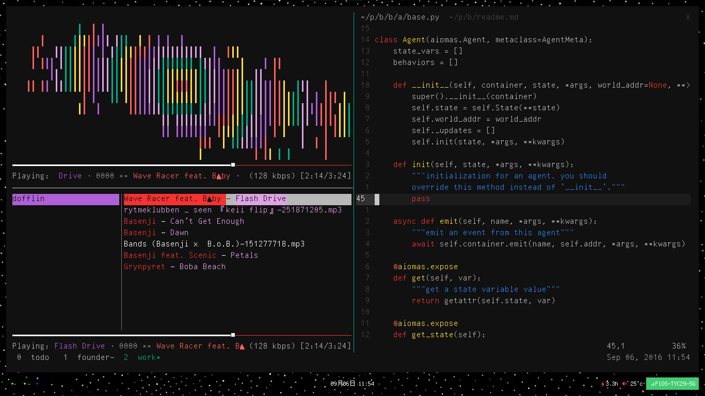
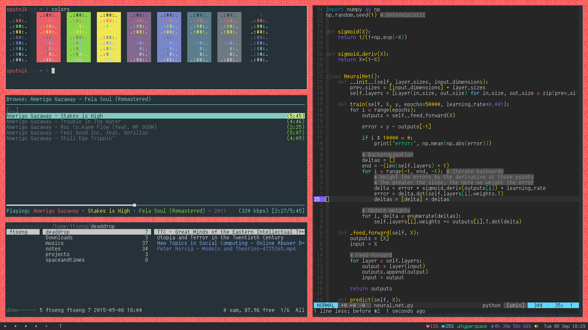

# DippinDots

These are my personal dotfiles for Linux (OpenSUSE Tumbleweed on a Legion Go).
Please feel free to use/modify them as you like!

## Usage

For a fresh Tumbleweed install I select the "server" preset.

    sudo zypper install git-core make
    git clone https://github.com/frnsys/dippindots.git ~/.dots
    make

Some things are best setup after everything else is installed and the system has been rebooted. Search for `POST-INSTALL` in `Makefile` for instructions.

Other system settings (e.g. hiding the boot menu) can be accessed via `sudo -E yast2`.

You can change the default TTY font:

```
sudo vi /etc/vconsole.conf

FONT=iso01-12x22
```

And set the hostname:

```
sudo hostnamectl set-hostname taiga
```

## Screenshots






